# Notes Manager API

A Django REST Framework API for managing personal notes with JWT authentication and role-based access control.

---

## Tech Stack

| Layer          | Choice                             |
|----------------|------------------------------------|
| Framework      | Django 5 + Django REST Framework   |
| Database       | SQLite (dev) / PostgreSQL (prod)   |
| Auth           | JWT via `djangorestframework-simplejwt` |
| Filtering      | `django-filter` + DRF search       |
| Config         | `python-dotenv`                    |

---

## Project Structure

```
notes_api/
├── manage.py
├── .env.example
├── requirements.txt
├── notes_api/          # Core Django config
│   ├── settings.py
│   └── urls.py
├── users/              # Auth + user roles
│   ├── models.py       # Custom User with role field
│   ├── serializers.py  # Register + JWT serializers
│   ├── views.py        # Register, login, refresh, profile
│   └── urls.py
└── notes/              # Notes CRUD
    ├── models.py        # Note model
    ├── permissions.py   # IsOwnerOrAdmin permission
    ├── serializers.py
    ├── views.py         # List, create, detail, update, delete
    └── urls.py
```

---

## Local Setup

### 1. Clone / download the project

```bash
cd notes_api
```

### 2. Create and activate a virtual environment

```bash
python -m venv venv
source venv/bin/activate        # macOS/Linux
venv\Scripts\activate           # Windows
```

### 3. Install dependencies

```bash
pip install -r requirements.txt
```

### 4. Configure environment variables

```bash
cp .env.example .env
# Open .env and set your SECRET_KEY at minimum
```

### 5. Run migrations

```bash
python manage.py migrate
```

### 6. (Optional) Create a superuser / admin

```bash
python manage.py createsuperuser
# Then in Django shell, set their role to admin:
python manage.py shell
>>> from users.models import User
>>> u = User.objects.get(username='your_username')
>>> u.role = 'admin'
>>> u.save()
```

### 7. Start the development server

```bash
python manage.py runserver
```

API is now live at `http://127.0.0.1:8000/`

---

## API Endpoints

### Base URL: `http://127.0.0.1:8000/api`

| Method | Endpoint             | Auth Required | Description                  |
|--------|----------------------|---------------|------------------------------|
| POST   | /auth/register/      | No            | Register a new user          |
| POST   | /auth/login/         | No            | Login and get tokens         |
| POST   | /auth/refresh/       | No            | Refresh access token         |
| GET    | /auth/profile/       | Yes           | View own profile             |
| GET    | /notes/              | Yes           | List notes                   |
| POST   | /notes/              | Yes           | Create a note                |
| GET    | /notes/<id>/         | Yes           | Get a specific note          |
| PUT    | /notes/<id>/         | Yes           | Full update a note           |
| PATCH  | /notes/<id>/         | Yes           | Partial update a note        |
| DELETE | /notes/<id>/         | Yes           | Delete a note                |

---

## Example API Requests

### Register

```http
POST /api/auth/register/
Content-Type: application/json

{
  "username": "alice",
  "email": "alice@example.com",
  "password": "SecurePass123!",
  "password_confirm": "SecurePass123!"
}
```

**Response `201`:**
```json
{
  "message": "Account created successfully.",
  "user": {
    "id": 1,
    "username": "alice",
    "email": "alice@example.com",
    "role": "user",
    "date_joined": "2024-01-15T10:00:00Z"
  }
}
```

---

### Login

```http
POST /api/auth/login/
Content-Type: application/json

{
  "username": "alice",
  "password": "SecurePass123!"
}
```

**Response `200`:**
```json
{
  "access": "eyJ0eXAiOiJKV1Q...",
  "refresh": "eyJ0eXAiOiJKV1Q..."
}
```

---

### Refresh Token

```http
POST /api/auth/refresh/
Content-Type: application/json

{
  "refresh": "eyJ0eXAiOiJKV1Q..."
}
```

---

### Create a Note

```http
POST /api/notes/
Authorization: Bearer <access_token>
Content-Type: application/json

{
  "title": "Shopping List",
  "content": "Milk, eggs, bread"
}
```

**Response `201`:**
```json
{
  "id": 1,
  "title": "Shopping List",
  "content": "Milk, eggs, bread",
  "owner_username": "alice",
  "created_at": "2024-01-15T10:05:00Z",
  "updated_at": "2024-01-15T10:05:00Z"
}
```

---

### List Notes (with search and pagination)

```http
GET /api/notes/?search=shopping&page=1
Authorization: Bearer <access_token>
```

**Response `200`:**
```json
{
  "count": 1,
  "next": null,
  "previous": null,
  "results": [
    {
      "id": 1,
      "title": "Shopping List",
      "content": "Milk, eggs, bread",
      "owner_username": "alice",
      "created_at": "2024-01-15T10:05:00Z",
      "updated_at": "2024-01-15T10:05:00Z"
    }
  ]
}
```

---

### Update a Note

```http
PATCH /api/notes/1/
Authorization: Bearer <access_token>
Content-Type: application/json

{
  "content": "Milk, eggs, bread, butter"
}
```

---

### Delete a Note

```http
DELETE /api/notes/1/
Authorization: Bearer <access_token>
```

**Response `200`:**
```json
{
  "message": "Note deleted successfully."
}
```

---

## Role-Based Access Control

| Action              | Regular User        | Admin User         |
|---------------------|---------------------|--------------------|
| Register / Login    | ✅                  | ✅                 |
| Create note         | ✅ (own)            | ✅ (own)           |
| View notes          | ✅ (own only)       | ✅ (all notes)     |
| Edit note           | ✅ (own only)       | ❌ (others' notes) |
| Delete note         | ✅ (own only)       | ✅ (any note)      |

---

## Error Responses

| Status | Meaning                        | Example trigger                  |
|--------|--------------------------------|----------------------------------|
| 400    | Bad Request / Validation error | Missing fields, password mismatch|
| 401    | Unauthorized                   | Missing or invalid token         |
| 403    | Forbidden                      | Accessing another user's note    |
| 404    | Not Found                      | Note ID doesn't exist            |

---

## Optional Features Included

- **Pagination** — `?page=N` (10 results per page, configurable in settings)
- **Search** — `?search=keyword` searches note titles
- **Ordering** — `?ordering=created_at` or `?ordering=-updated_at`
- **Refresh token rotation** — Each refresh issues a new refresh token; old one is blacklisted

---

## API Tests — Postman Screenshots

All endpoints were tested manually using Postman. Screenshots below show requests and responses.

### Test 1 — Register a New User
> `POST /api/auth/register/` — Expected: `201 Created`

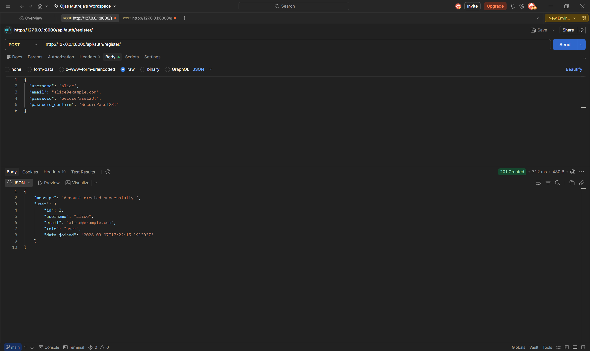

---

### Test 2 — Login and Receive Tokens
> `POST /api/auth/login/` — Expected: `200 OK` with access + refresh tokens

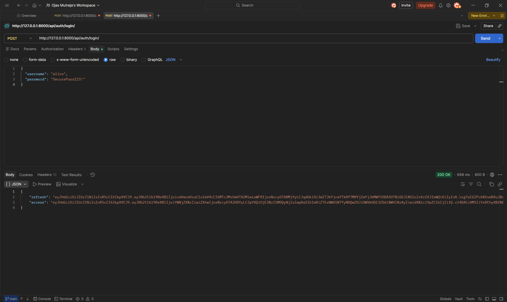

---

### Test 3 — View Profile (Authenticated)
> `GET /api/auth/profile/` — Expected: `200 OK` with user details

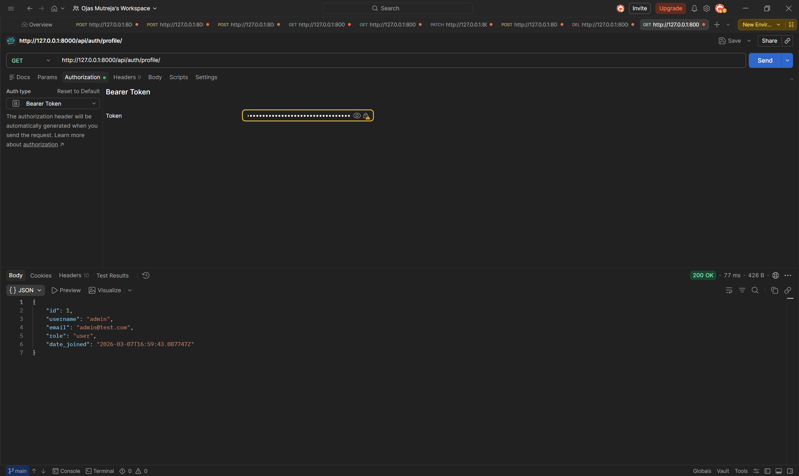

---

### Test 4 — Create a Note
> `POST /api/notes/` — Expected: `201 Created` with note object

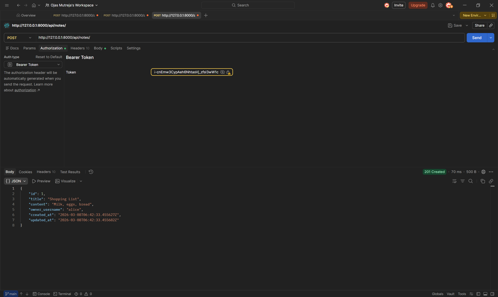

---

### Test 5 — List Notes (Paginated)
> `GET /api/notes/` — Expected: `200 OK` with paginated results

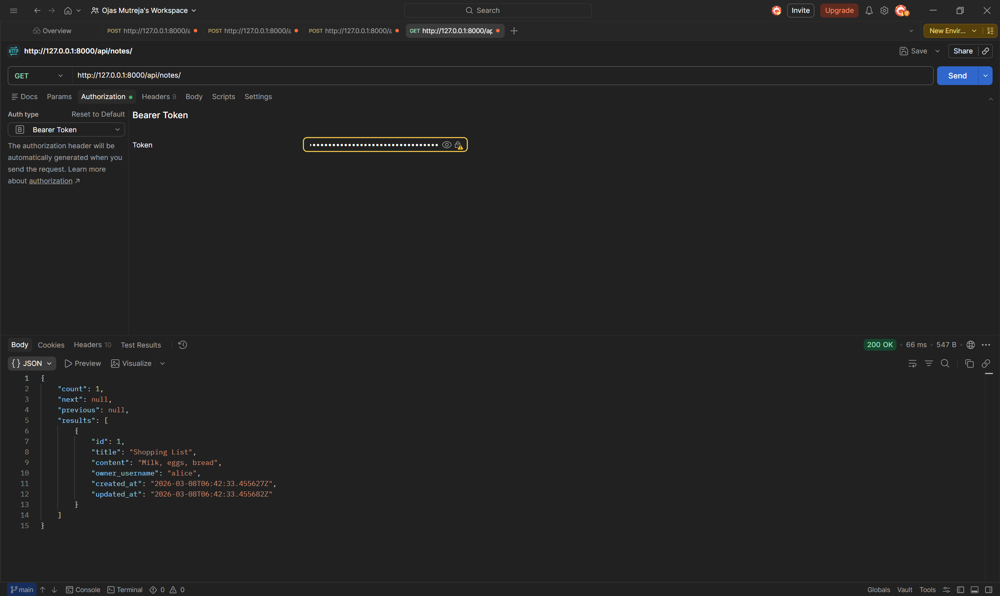

---

### Test 6 — Search Notes by Title
> `GET /api/notes/?search=shopping` — Expected: `200 OK` with filtered results

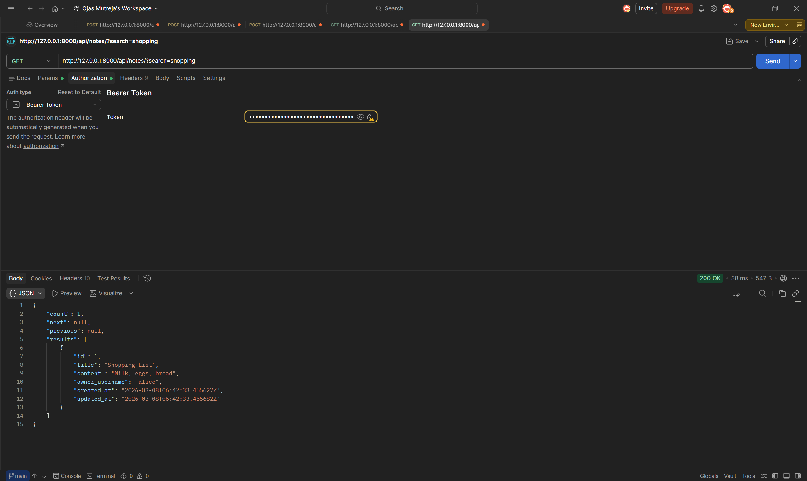

---

### Test 7 — Update a Note (PATCH)
> `PATCH /api/notes/1/` — Expected: `200 OK` with updated content

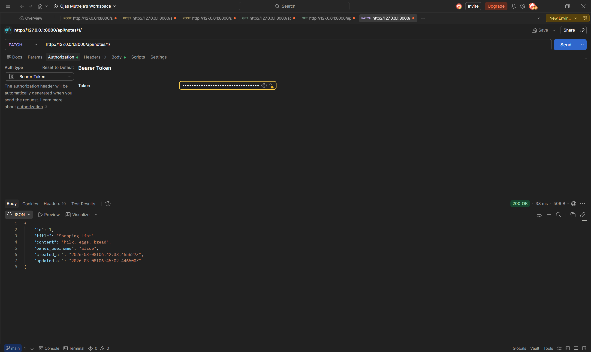

---

### Test 8 — Access Another User's Note (Ownership Enforcement)
> `GET /api/notes/1/` as Bob trying to access Alice's note — Expected: `404 Not Found`

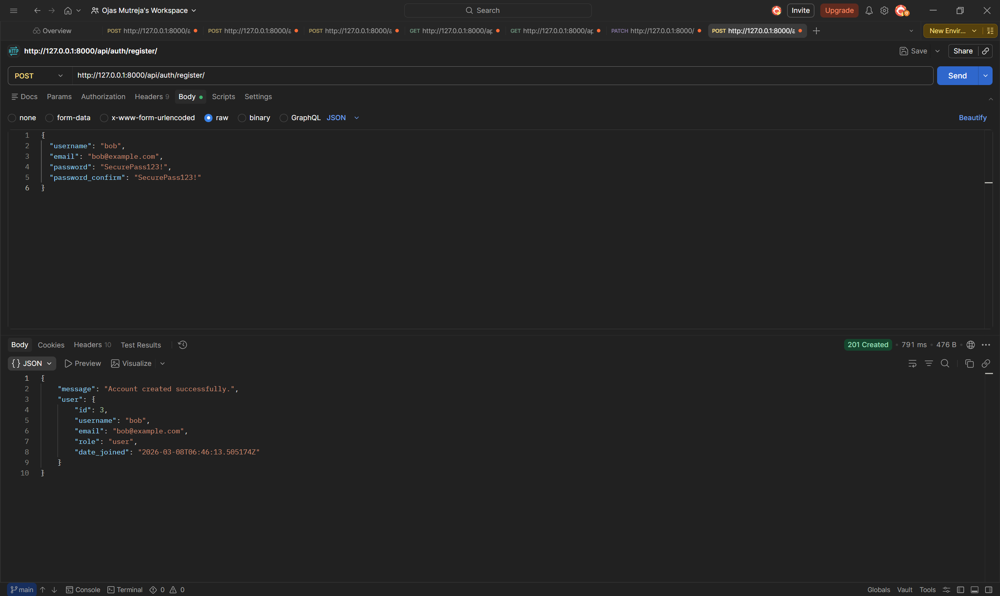
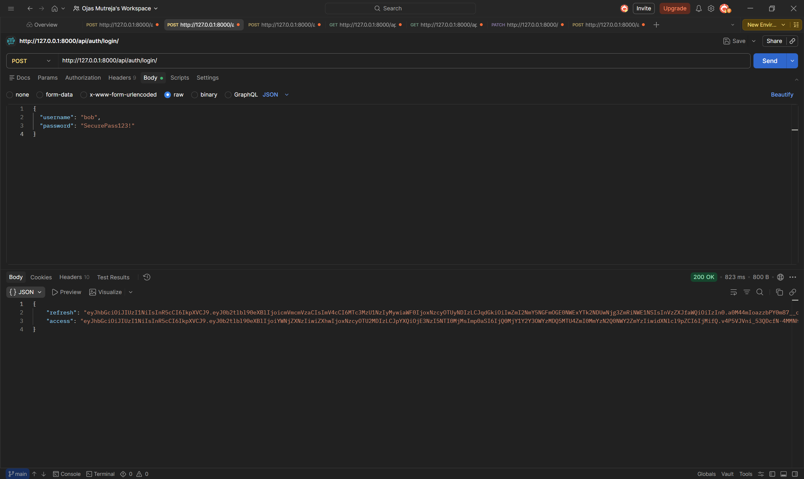
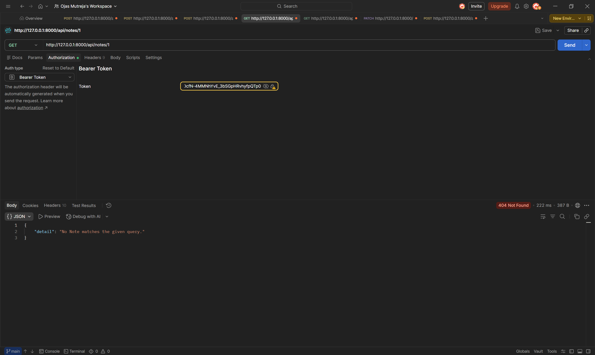
---

### Test 9 — Request Without Token
> `GET /api/notes/` with no Authorization header — Expected: `401 Unauthorized`

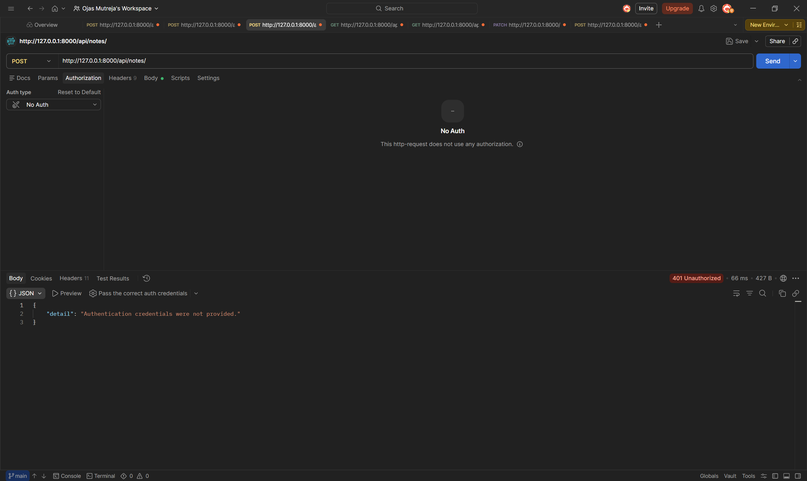

---

### Test 10 — Admin Views All Notes
> `GET /api/notes/` as admin — Expected: `200 OK` with notes from all users


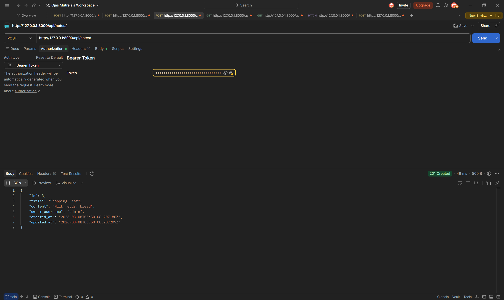

---

### Test 11 — Admin Deletes Any Note
> `DELETE /api/notes/1/` as admin — Expected: `200 OK` with success message

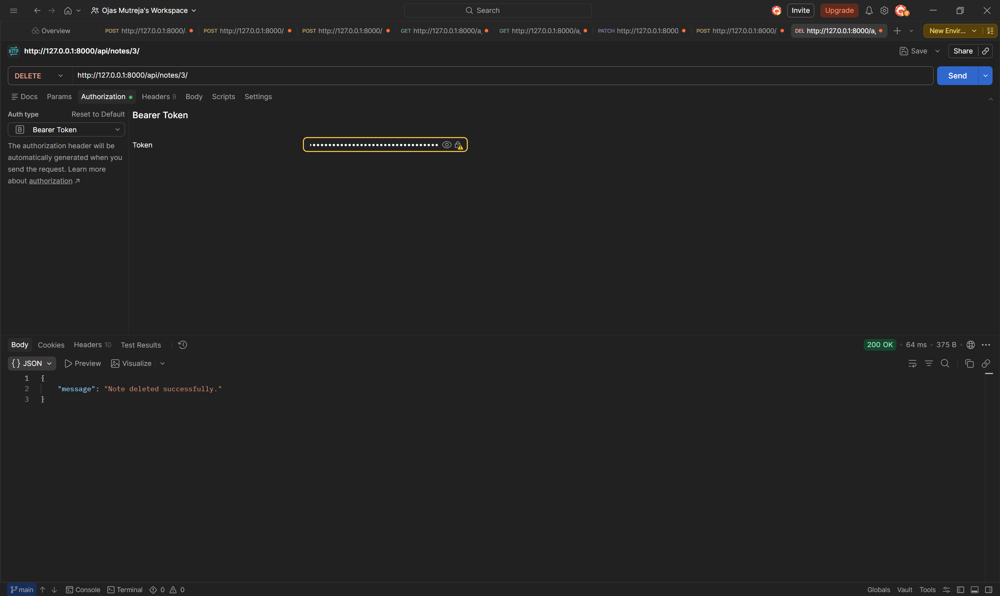